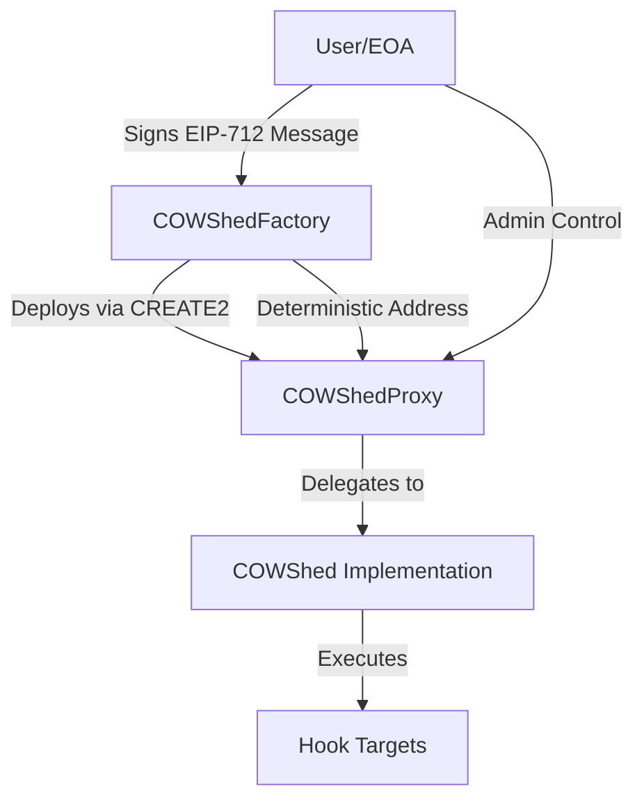

# System Architecture

COW Shed consists of three core smart contracts working together to enable permissioned hooks on CoW Protocol orders.

## Component Overview



<CardGroup cols={3}>
  <Card title="COWShed" icon="cube">
    The implementation contract containing all hook execution logic and authentication
  </Card>
  <Card title="COWShedProxy" icon="layer-group">
    User-owned ERC1967 transparent proxy with immutable admin
  </Card>
  <Card title="COWShedFactory" icon="industry">
    Factory for deterministic proxy deployment and hook execution orchestration
  </Card>
</CardGroup>

## COWShedProxy: The User's Contract

The `COWShedProxy` is an ERC1967 transparent proxy that serves as the user's personal contract instance.

### Key Features

**Deterministic Deployment**  
Proxies are deployed using CREATE2 with the user's address as the salt, ensuring a predictable address:

```solidity
// From src/COWShedFactory.sol:60-72
function proxyOf(address who) public view returns (address) {
    bytes32 initCodeHash = keccak256(
        abi.encodePacked(PROXY_CREATION_CODE, abi.encode(implementation, who))
    );
    return address(
        uint160(
            uint256(
                keccak256(
                    abi.encodePacked(hex"ff", address(this), bytes32(uint256(uint160(who))), initCodeHash)
                )
            )
        )
    );
}
```

**Immutable Admin**  
The proxy stores the user's address as an immutable variable (src/COWShedProxy.sol:13), making admin checks gas-efficient:

```solidity
// From src/COWShedProxy.sol:15-16
constructor(address implementation, address admin_) {
    ADMIN = admin_;
    assembly {
        sstore(IMPLEMENTATION_STORAGE_SLOT, implementation)
    }
}
```

**Transparent Proxy Pattern**  
The proxy implements transparency by handling `admin()` and `updateImplementation()` calls differently based on the caller (src/COWShedProxy.sol:24-49).

<Info>
The transparent proxy pattern ensures the admin cannot accidentally call implementation functions, preventing potential conflicts.
</Info>

### Storage Layout

COWShedProxy uses ERC1967 standard storage slots to avoid collisions:

- **Implementation slot**: `0x360894a13ba1a3210667c828492db98dca3e2076cc3735a920a3ca505d382bbc`
- **State slot**: `keccak256("COWShed.State")` (src/COWShedStorage.sol:27)

## COWShed: The Implementation

The `COWShed` contract contains all the business logic for hook execution and authentication.

### State Structure

The implementation stores state in a dedicated storage slot:

```solidity
// From src/COWShedStorage.sol:20-25
struct State {
    bool initialized;
    address trustedExecutor;
    LibBitmap.Bitmap nonces;
    IPreSignStorage preSignStorage;
}
```

**Fields:**
- `initialized`: Prevents re-initialization attacks
- `trustedExecutor`: Address that can execute hooks without signatures (typically the factory)
- `nonces`: Bitmap for efficient nonce management
- `preSignStorage`: Optional storage contract for on-chain pre-signatures

### Hook Execution Flow

The main entry point for executing hooks is `executeHooks()`:

```solidity
// From src/COWShed.sol:55-63
function executeHooks(
    Call[] calldata calls,
    bytes32 nonce,
    uint256 deadline,
    bytes calldata signature
) external {
    address admin = _admin();
    (bool authorized) = LibAuthenticatedHooks.authenticateHooks(
        calls, nonce, deadline, admin, signature, domainSeparator()
    );
    if (!authorized) {
        revert InvalidSignature();
    }
    _executeCalls(calls, nonce);
}
```

**Steps:**
1. Retrieve the proxy admin (user address)
2. Authenticate the signature using EIP-712
3. Verify the nonce hasn't been used
4. Execute the calls
5. Mark the nonce as used

### Authentication Library

`LibAuthenticatedHooks` handles signature verification for both EOAs and smart contracts:

```solidity
// From src/LibAuthenticatedHooks.sol:31-53
function authenticateHooks(
    Call[] calldata calls,
    bytes32 nonce,
    uint256 deadline,
    address user,
    bytes calldata signature,
    bytes32 domainSeparator
) internal view returns (bool) {
    verifyDeadline(deadline);
    bytes32 toSign = hashToSign(calls, nonce, deadline, domainSeparator);

    // smart contract signer
    if (user.code.length > 0) {
        bool isAuthorized = IERC1271(user).isValidSignature(toSign, signature) == MAGIC_VALUE_1271;
        return (isAuthorized);
    }
    // eoa signer
    else {
        (bytes32 r, bytes32 s, uint8 v) = decodeEOASignature(signature);
        address recovered = ECDSA.recover(toSign, v, r, s);
        return user == recovered;
    }
}
```

<Note>
The authentication library checks if the user address has code to determine whether to use EIP-1271 or ECDSA verification.
</Note>

### EIP-712 Domain Separator

Each proxy has its own domain separator to prevent cross-proxy replay attacks:

```solidity
// From src/COWShed.sol:152-157
function domainSeparator() public view returns (bytes32) {
    string memory name = "COWShed";
    return keccak256(
        abi.encode(domainTypeHash, keccak256(bytes(name)), keccak256(bytes(VERSION)), block.chainid, address(this))
    );
}
```

The domain separator includes:
- Contract name: "COWShed"
- Version: "2.1.0" (src/COWShed.sol:23)
- Chain ID: Prevents cross-chain replays
- Verifying contract: The proxy address

### Nonce Management

COW Shed uses a bitmap for efficient nonce storage:

```solidity
// From src/COWShedStorage.sol:40-47
function _useNonce(bytes32 _nonce) internal {
    if (_isNonceUsed(_nonce)) revert NonceAlreadyUsed();
    _state().nonces.set(uint256(_nonce));
}

function _isNonceUsed(bytes32 _nonce) internal view returns (bool) {
    return _state().nonces.get(uint256(_nonce));
}
```

**Benefits:**
- Supports non-sequential nonces for parallel order execution
- Sequential nonces save gas by setting adjacent bits
- Users can revoke nonces to invalidate signatures (src/COWShed.sol:140-142)

## COWShedFactory: Deployment & Orchestration

The factory manages proxy deployment and serves as the initial trusted executor.

### Deterministic Deployment

The factory deploys proxies on-demand using CREATE2:

```solidity
// From src/COWShedFactory.sol:74-85
function _initializeProxy(address user, address proxy) internal returns (bool newlyDeployed) {
    // deploy and initialize proxy if it doesnt exist
    if (proxy.code.length == 0) {
        COWShedProxy newProxy = new COWShedProxy{salt: bytes32(uint256(uint160(user)))}(
            implementation,
            user
        );
        COWShed(payable(proxy)).initialize(address(this));
        emit COWShedBuilt(user, address(newProxy));

        ownerOf[proxy] = user;
        newlyDeployed = true;
    }
}
```

**Process:**
1. Check if code exists at the deterministic address
2. If not, deploy the proxy using CREATE2 with user's address as salt
3. Initialize the proxy with the factory as the trusted executor
4. Record the ownership mapping

<Warning>
The factory can only initialize a proxy once. After initialization, the `initialized` flag prevents re-initialization attacks (src/COWShed.sol:46-52).
</Warning>

### Hook Execution via Factory

The factory provides a convenience method for deploying and executing in one call:

```solidity
// From src/COWShedFactory.sol:42-56
function executeHooks(
    Call[] calldata calls,
    bytes32 nonce,
    uint256 deadline,
    address user,
    bytes calldata signature
) external {
    address proxy = proxyOf(user);
    // initialize the proxy
    _initializeProxy(user, proxy);

    // execute the hooks, the authorization checks are implemented in the
    // COWShed.executeHooks function
    COWShed(payable(proxy)).executeHooks(calls, nonce, deadline, signature);
}
```

## Call Execution

Hooks are executed through the `Call` struct:

```solidity
// From src/ICOWAuthHook.sol:6-12
struct Call {
    address target;
    uint256 value;
    bytes callData;
    bool allowFailure;
    bool isDelegateCall;
}
```

The execution logic supports both regular and delegate calls:

```solidity
// From src/LibAuthenticatedHooks.sol:162-183
function executeCalls(Call[] calldata calls) internal {
    for (uint256 i = 0; i < calls.length;) {
        Call memory call = calls[i];
        bool success;
        bytes memory ret;
        if (call.isDelegateCall) {
            (success, ret) = call.target.delegatecall(call.callData);
        } else {
            (success, ret) = call.target.call{value: call.value}(call.callData);
        }
        if (!success && !call.allowFailure) {
            // bubble up the revert message
            assembly ("memory-safe") {
                revert(add(ret, 0x20), mload(ret))
            }
        }

        unchecked {
            ++i;
        }
    }
}
```

**Features:**
- Support for ETH transfers via `value` parameter
- Optional delegate calls for advanced use cases
- Configurable failure handling per call
- Revert message bubbling for debugging

## Pre-Signature Support

COW Shed supports on-chain pre-signatures for contracts that cannot sign off-chain:

```solidity
// From src/COWShed.sol:92-100
function preSignHooks(
    Call[] calldata calls,
    bytes32 nonce,
    uint256 deadline,
    bool signed
) external onlyAdmin {
    bytes32 hash = LibAuthenticatedHooks.executeHooksMessageHash(calls, nonce, deadline);
    
    IPreSignStorage storageContract = _state().preSignStorage;
    if (storageContract == EMPTY_PRE_SIGN_STORAGE) {
        revert PreSignStorageNotSet();
    }
    storageContract.setPreSigned(hash, signed);
}
```

**Workflow:**
1. Admin calls `resetPreSignStorage()` to deploy a storage contract
2. Admin calls `preSignHooks()` to mark hook hashes as signed
3. Anyone can call `executePreSignedHooks()` to execute signed hooks

## Upgrade Mechanism

Both the proxy and implementation support upgrades:

**Proxy-level upgrade** (src/COWShedProxy.sol:24-35):  
Only the admin can update the implementation address stored in the ERC1967 slot.

**Implementation-level upgrade** (src/COWShed.sol:132-137):  
Only the admin can update the implementation through the current implementation.

```solidity
function updateImplementation(address newImplementation) external onlyAdmin {
    assembly {
        sstore(IMPLEMENTATION_STORAGE_SLOT, newImplementation)
    }
    emit Upgraded(newImplementation);
}
```

<Tip>
Upgrades allow users to access new features and bug fixes while maintaining the same proxy address.
</Tip>

## Security Considerations

### Access Control

- **Admin-only functions**: Implementation upgrades, nonce revocation, pre-signature management
- **Trusted executor role**: Can execute hooks without signatures, initially set to factory
- **Self-only functions**: Updating the trusted executor requires a call from the proxy itself

### Initialization Protection

The proxy reverts all calls except `initialize()` before initialization:

```solidity
// From src/COWShedProxy.sol:68-70
function _checkInitialization() internal view {
    if (!_state().initialized && msg.sig != COWShed.initialize.selector) 
        revert InvalidInitialization();
}
```

### Signature Replay Protection

1. **Nonces**: Prevent replay of the same signature
2. **Deadlines**: Prevent execution of stale signatures
3. **Domain separator**: Includes chain ID and contract address

## Gas Optimizations

- **Immutable admin**: Saves gas on every admin check (src/COWShedProxy.sol:13)
- **Bitmap nonces**: More efficient than mapping for sequential nonces
- **Assembly usage**: Direct storage access in critical paths
- **CREATE2 salt**: User address as salt enables simple deterministic addressing

## Integration with CoW Protocol

COW Shed integrates with CoW Protocol orders through:

1. **Receiver address**: Set to the deterministic proxy address
2. **Pre-hooks**: Executed before the order settles
3. **Post-hooks**: Executed after tokens are received
4. **Signature attachment**: EIP-712 signature passed with the order

The CoW Protocol settlement contract calls the factory's `executeHooks()` function, which handles deployment and execution atomically.

<CardGroup cols={2}>
  <Card title="Contract Reference" icon="book" href="/api/cowshed">
    Detailed API documentation for all contracts
  </Card>
  <Card title="Examples" icon="code" href="/examples/overview">
    See architecture in action with real examples
  </Card>
</CardGroup>
